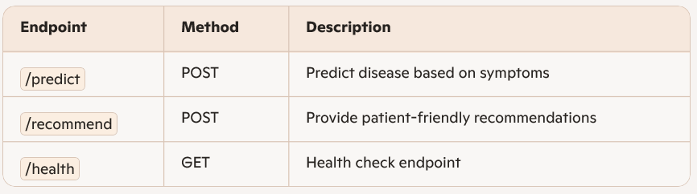

# 🩺 Disease Predictive System / MediCare backend

A robust, scalable medical prediction system that combines classical ML models (RandomForest) with transformer-based embeddings (BERT/Gemini) to deliver accurate, patient-friendly health insights via a Flask API backend.

---

## 🚀 Features
- **Machine Learning Models**: RandomForest + transformer embeddings for refined predictions.
- **Conversational AI Integration**: Gemini API for natural language symptom analysis.
- **Backend**: Flask REST API with secure endpoints.
- **Deployment**: Ready for Render cloud deployment.
- **Output Formatting**: Clean, structured, patient-friendly responses.

---

## 📂 Project Structure

<p align="center">
  
</p>


---

## ⚙️ Installation

 ## Clone the repo
   ```bash
   git clone https://github.com/22p31a0593/medicare-backend.git
   cd medicare-backend
   ```

 ## Create virtual environment
    ```bash
    python -m venv venv
    source venv/bin/activate   # Linux/Mac
    venv\Scripts\activate      # Windows
    ```

## Install dependencies
   ```bash
   pip install -r requirements.txt
   ```

## ▶️ Running Locally
 
  ```bash
  flask run
  ```
## 📡 API Endpoints



## 📖 Future Improvements

- Expand dataset coverage.
- Add fallback logic for API quota limits.
- Enhance multilingual support.
- Integrate React Native frontend.


## 🛡️ Disclaimer

This system is for educational and research purposes only. It is not a substitute for professional medical advice. Always consult a qualified healthcare provider for medical concerns.


